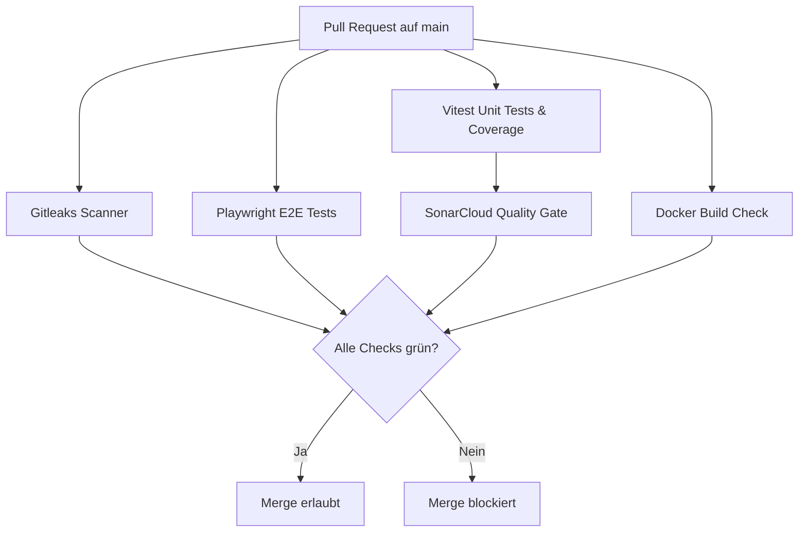
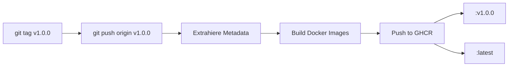

# System-Architektur & CI/CD Pipeline

Dieses Projekt nutzt eine moderne, entkoppelte Monorepo-Architektur, um Frontend und Backend effizient nebeneinander zu betreiben.

## 🏗️ Monorepo Struktur

- **Frontend (`apps/web`):** 
  - Framework: Next.js (React) mit TypeScript
  - Styling: Tailwind CSS & Shadcn/UI
  - Package Manager: `pnpm`
- **Backend (`apps/api`):** 
  - Framework: FastAPI (Python)
  - Package Manager: `uv` (extrem schneller Resolver für Python)
- **Containerisierung:**
  - Jede App besitzt ein eigenes `Dockerfile` (Multi-Stage Builds basierend auf Alpine)
  - Lokales Setup via `docker-compose.yml`

---

## 🚦 CI/CD Pipeline

Das Projekt nutzt GitHub Actions für Continuous Integration (CI) und Continuous Deployment (CD). Die Pipeline ist auf höchste Stabilität ausgelegt.

### 1. Pull Request Gates (`scan.yml`)

Jeder Pull Request (PR) gegen den `main`-Branch wird automatisch geprüft. Ohne grüne Checks gibt es keinen Merge.

*Hinweis: Der Docker Build Check simuliert einen Container-Build (Dry-Run), schiebt aber keine Images in die Registry.*

### 2. Release & Publish (`docker-publish.yml`)

Releases in die Container-Registry (GHCR) erfolgen nicht automatisch bei einem Merge, sondern explizit über **Git Tags**.

